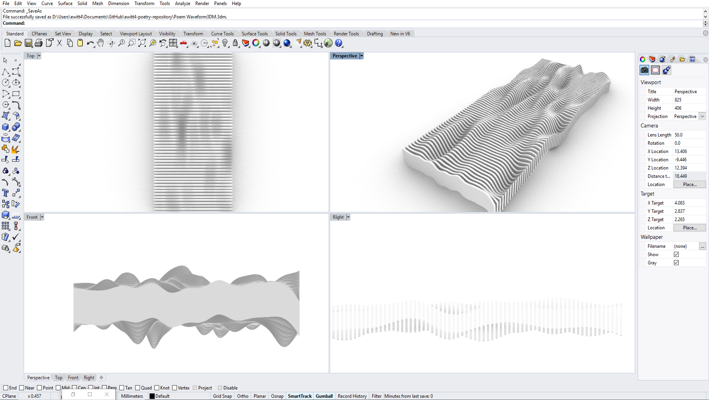
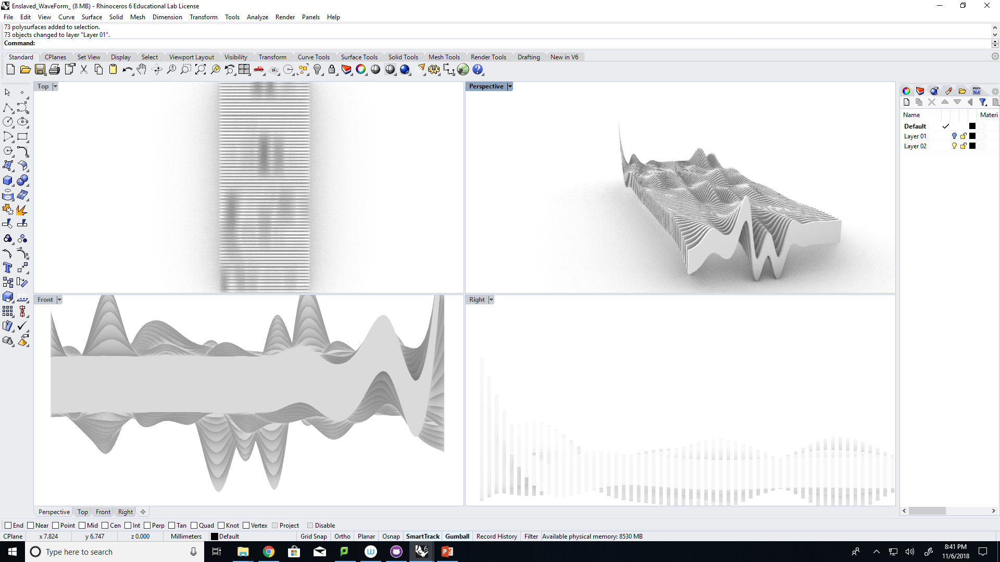

# ewitt4-poetry-repository

Artist Statement ☥
---

I speak the names and imagine the lives of all those who where enslaved and forgotten.
May they live in my thoughts and be reinvigorated through my voice.

## Process ☥

There are 2 seperate processes for the poems that are being generated.

In ancient Egyptian mythology, it is said that once someone's name is written in stone or their likeness is forever left behind after death, their souls would forever live on and can be remembered for millions of years.
For the text of the ancient Egyptians, I select a piece of a ancient Egyptian literature and allow the computer through the use of Spyder and class lectures to generate new text from the arcane.  

For the text of the enslaved, it may not look like a poem but what a poem is supposed to look like is subjective.  After researching 17th and 18th inventories that contain the names, age, and occupations of enslaved Africans and African Americans, I picked a few whose names that are still widely used today.  After selecting these names, I input them into Spyder and through in class lessons, generate new names, occupations, and ages.  To me, this process is giving acknowledgement to those enslaved people who's names and identities were lost to history.  This personally helps me to feel connected to the ancestors who's identities were lost to me in history but who's presence I always feel.

## Poetry Results (☥)

---

I am the only One, who proceedeth from an only One who dwelleth in my body.

---

In the morningboat,
You travel the sky in peace.
All your enemies

As RA everyday,
Alive and stable as my 
Lord RA, true of voice

Stars worship you, your
Beauty in my eyes, your light
Unfurling on my brow.

Unfurling on my
Breast. You go, you rest in the 
Horizon of the west.

## Poetry Results (2)

Inspire not men with fear, else Ptah will take away the unteachable.
Tomorrow knowledge will support him while the ignorant in the words of every man,
Great or small, is a blameworthy person who departs from this rule.
Speak not to absent yourself, even when weariness over takes you.
Keep an eye on them who, if you are one of the good, you can.
He Is your son, a person attached to you as above appreciation
And all contrary argument is a twofold joy for both. 
When wise things are added to good things let your countenance be cheerful,
During the time of your neighbors better is a lost to him whose temper is turbulent
And he is made from what the great Ptah has given you,
Do not endure when it slackens.

## Poetry Results (3-Final)

Big George 45 Sugar-Maker
Lovelace 30 Ploughman
Louis 30 Cook
Lawson 35 Cooper
James 35 mason
Phillip 50 Field Hand
Ben 60 Blacksmith
Edward 9 Orphan
Eliza 50 Ironer
Etienne 53 Foreman
Mingo 18 Fieldhand
Lucille 26 Fieldhand
Marianne 30 Cook
Celeste 16 Fieldhand
James 48 glazier
Louisa 35 Hospital Worker
Caroline 38 Babymaker
Johnette 35 Cook
Elmira 35 Sickly
Peggy 30 Good Hand

Thomas 16 Wagoneer
Rasmus 35 Fieldhand
Alfred 21 Househand
Jones 17 Smith
Miles 22 Wagoneer
Jesse 34 Fieldhand
Adele 42 Fieldhand
Poly 24 Seamstress
Jackson 20 Runner
Ma Bell 57 Cook
Emily 12 Laundry/Linens
Adam 19 Miller
Mosco 20 Miler
Hanna 11 House maid
Estelle 35 Weaver
Jina 17 Seamstress
Moses 59 House hand
Jimbo 26 Wagoneer
David 5 Child
Adalene 3 Child

Perry 40 Driver
Old Daniele 70 Old and Decrepid
John Miller 28 Runaway Full hand
Claiborn West 28 Good Negro
Orange 28 Good hand
George 25 Cooper
Jefferson 28 Superior Hand
Simond 45 Carpenter (Greatest Rascal on Plantation)
Charles Mena 45 African
Ashe

